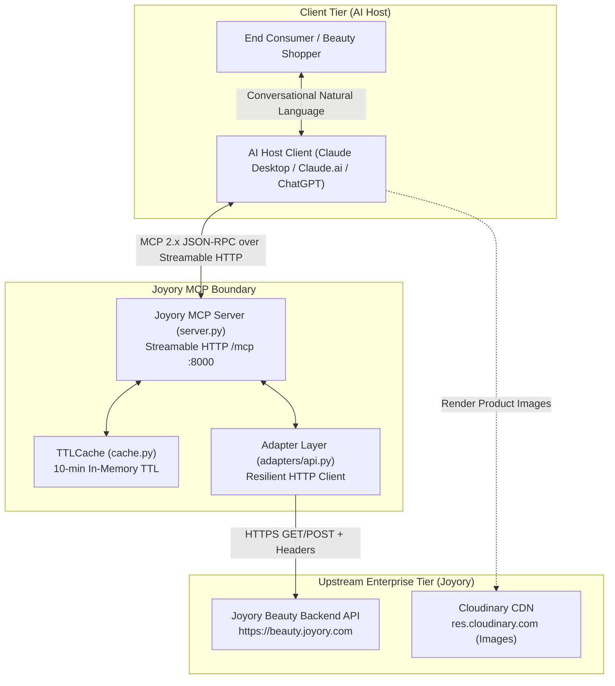
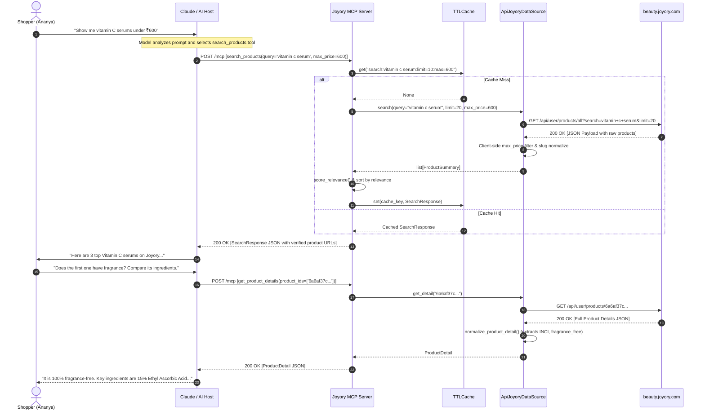
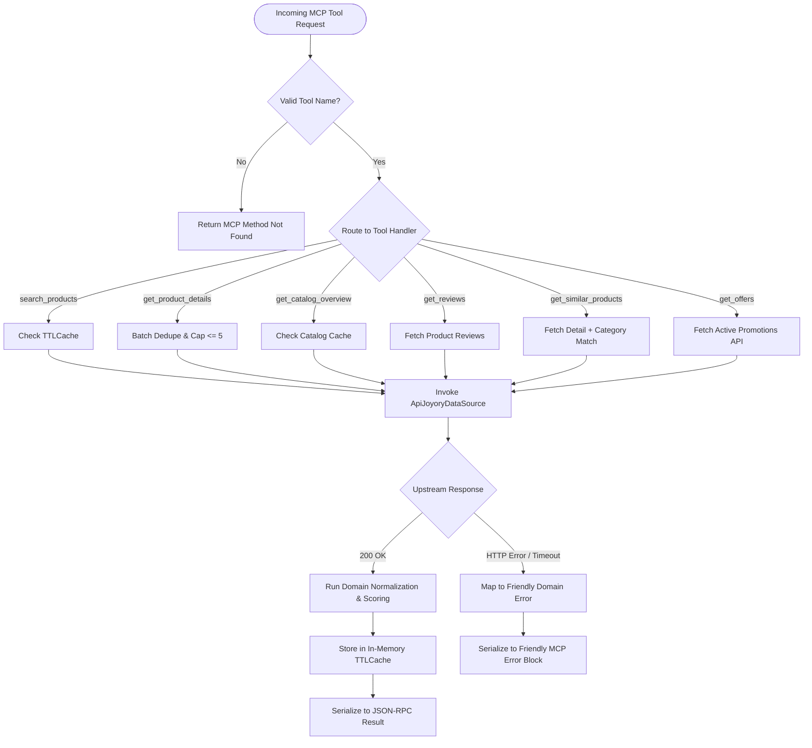

# System Architecture Document
## Project: Joyory Conversational Commerce MCP Connector
**Document Version:** 2.0  
**Target Architecture:** Model Context Protocol (MCP 2.x Streamable HTTP)  
**Author:** Software Architecture Team  

---

## 1. Architectural Overview

The **Joyory MCP Connector** is engineered as a stateless, read-only middleware bridge adhering to the open **Model Context Protocol (MCP 2.x)** specification. It translates intent-driven tool invocations from AI host platforms (Anthropic Claude Desktop, Claude.ai, OpenAI ChatGPT) into deterministic, structured HTTP operations against Joyory's live product catalog (`beauty.joyory.com`).

Unlike traditional multi-tier web applications, the system contains:
* **No relational or NoSQL database:** Operates as an in-flight gateway with memory-efficient TTL caching.
* **No custom user frontend:** Delegates presentation and conversation management to MCP-compliant AI hosts.
* **No mutation or write pathways:** Strictly enforces read-only access to prevent unauthorized state modifications.

---

## 2. System Context (C4 Context Diagram)

The following diagram illustrates how the Joyory MCP Connector sits between AI client hosts and Joyory's upstream infrastructure:



---

## 3. Component Architecture

The codebase is organized into four modular, decoupled layers:

```mermaid
graph TB
    subgraph "1. Protocol & Server Layer"
        SRV["server.py (MCPServer)"]
        CFG["config.py (Env & Discovery Loader)"]
        SRV --- CFG
    end

    subgraph "2. Tool Business Logic Layer"
        T_SEARCH["tools/search.py<br/>(search_products)"]
        T_DETAIL["tools/details.py<br/>(get_product_details)"]
        T_CAT["tools/catalog.py<br/>(get_catalog_overview)"]
        T_REV["tools/reviews.py<br/>(get_reviews)"]
        T_SIM["tools/similar.py<br/>(get_similar_products)"]
        T_OFF["tools/offers.py<br/>(get_offers)"]
        SRV --> T_SEARCH
        SRV --> T_DETAIL
        SRV --> T_CAT
        SRV --> T_REV
        SRV --> T_SIM
        SRV --> T_OFF
    end

    subgraph "3. Domain, Normalization & Cache Layer"
        CACHE["cache.py (TTLCache Singleton)"]
        MODELS["models.py (Pydantic V2 Schemas)"]
        NORM["normalize.py (Cleaning, Scoring, Attribute Extraction)"]
        ERR["errors.py (Typed Domain Exceptions)"]
        T_SEARCH --> CACHE
        T_SEARCH --> NORM
        T_SEARCH --> MODELS
        T_DETAIL --> CACHE
        T_DETAIL --> NORM
        T_SIM --> NORM
    end

    subgraph "4. Data Adapter & Discovery Layer"
        BASE_ADAPT["adapters/base.py (JoyoryDataSource ABC)"]
        API_ADAPT["adapters/api.py (ApiJoyoryDataSource)"]
        BROWSER_ADAPT["adapters/browser.py (BrowserJoyoryDataSource Fallback)"]
        DISCOVER["discovery/discover.py (Automated Reverse-Engineering Engine)"]
        BASE_ADAPT <|-- API_ADAPT
        BASE_ADAPT <|-- BROWSER_ADAPT
        T_SEARCH --> API_ADAPT
        T_DETAIL --> API_ADAPT
        T_SIM --> API_ADAPT
    end
```

### Component Roles & Responsibilities

1. **`src/joyory_mcp/server.py`:**
   * Configures and runs the `MCPServer` instance (`joyory-product-mcp`).
   * Binds Streamable HTTP transport at `/mcp` with customizable host and port.
   * Executes startup pre-warming of catalog overview and active offers.
   * Exposes 6 strongly typed, decorated tools with rich descriptions.

2. **`src/joyory_mcp/tools/`:**
   * Contains individual tool handlers isolating specific business capabilities.
   * Enforces input bounds, parameter defaults, and concurrency rules.
   * Emits user-actionable hints in empty or ambiguous result sets.

3. **`src/joyory_mcp/normalize.py` & `models.py`:**
   * Translates unstandardized raw upstream JSON into immutable, validated Pydantic V2 models (`ProductSummary`, `ProductDetail`, `Variant`).
   * Normalizes brand slugs, cleans HTML descriptions, extracts INCI ingredients, and parses package sizes.
   * Computes unit price (`price_per_100ml`) and keyword relevance score.

4. **`src/joyory_mcp/cache.py`:**
   * In-memory thread-safe `TTLCache` with granular cache-key generation.
   * Default TTL of 600 seconds (10 minutes) protects upstream APIs from excessive request bursts.

5. **`src/joyory_mcp/adapters/`:**
   * Implements the Adapter Pattern via `JoyoryDataSource` abstract base class.
   * `ApiJoyoryDataSource` performs asynchronous HTTP calls via `httpx.AsyncClient` with custom headers (`Referer: https://joyory.com/`).
   * `BrowserJoyoryDataSource` provides a Playwright-based headless fallback should upstream endpoints introduce browser fingerprinting or Cloudflare challenges.

---

## 4. Request Lifecycle Sequence Diagram

The following sequence illustrates a representative user interaction: a shopper asking for recommendations, resulting in a parallel search followed by detailed ingredient comparison.



---

## 5. Tool Invocation & Routing Workflow



---

## 6. Security Boundaries & Data Isolation

1. **Zero State Persistence:** No user sessions, chat histories, or IP addresses are persisted to disk or external databases.
2. **Network Perimeter:** Outbound HTTP traffic is restricted exclusively to Joyory APIs and Cloudinary image CDNs.
3. **Transport Security:** Built on Streamable HTTP; supports reverse-proxy SSL termination (e.g., Render HTTPS, Cloudflare tunnel).
