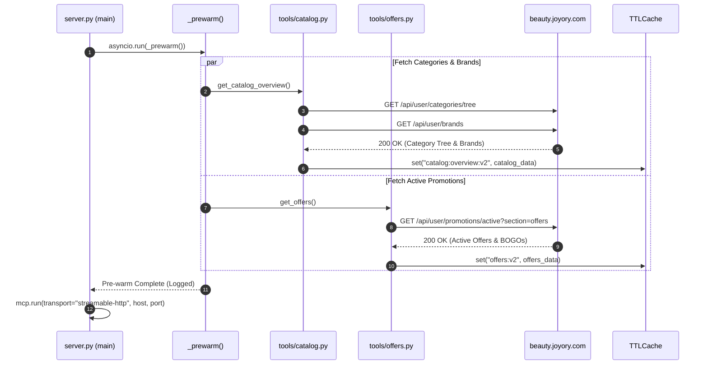
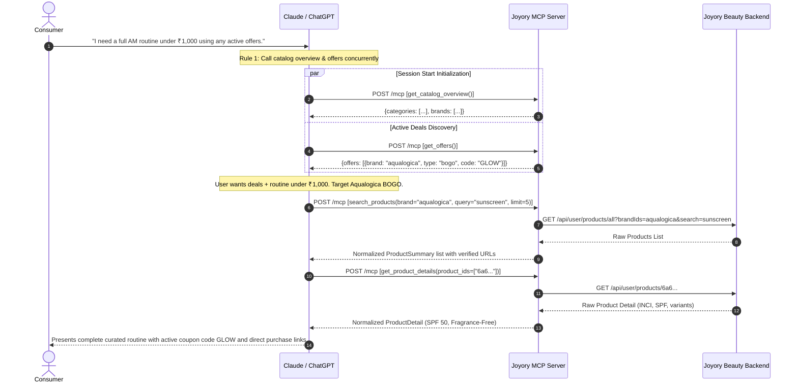
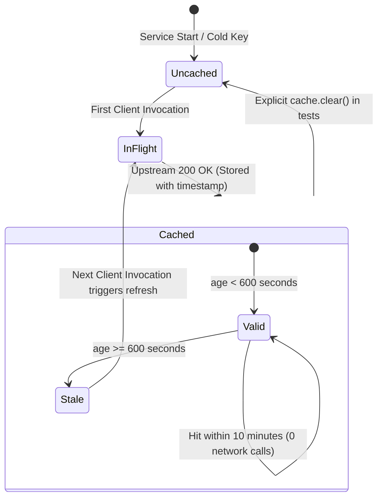

# End-to-End System Workflows
## Project: Joyory Conversational Commerce MCP Connector
**Document Version:** 2.0  
**Architectural Flow:** Intent → Protocol → Gateway → Normalization → Synthesis  

---

## 1. High-Level Transaction Lifecycle

Every interaction through Joyory MCP adheres to a disciplined, multi-stage pipeline:

```
[ User Intent ]
       │
       ▼
[ AI Host (Claude / ChatGPT) ]
       │   1. Tool Selection & JSON-RPC Construction
       ▼
[ MCP Streamable HTTP Layer (/mcp) ]
       │   2. Parameter Parsing & Pydantic Schema Validation
       ▼
[ Tool Business Logic Handler ]
       │   3. Cache Evaluation (TTLCache 10-Min)
      ┌┴────────────────────────┐
 [Cache Hit]               [Cache Miss]
      │                         │
      │ 4a. Return Cached JSON  │ 4b. Forward to ApiJoyoryDataSource
      │                         ▼
      │             [ Upstream HTTP Call (beauty.joyory.com) ]
      │                         │
      │                         ▼
      │             [ Normalization, Cleaning & Scoring ]
      │                         │
      │                         ▼
      │             [ Update TTLCache Singleton ]
      └─────────────────────────┬┘
                                │
                                ▼
                   [ MCP Response Serialization ]
                                │
                                ▼
            [ AI Host Synthesizes Card Presentation ]
                                │
                                ▼
                       [ User Presentation ]
```

---

## 2. Boot-Time Pre-Warming Workflow

To prevent the cold-start latency penalty common in serverless or newly spawned services, `server.py` executes an asynchronous warm-up routine prior to accepting client traffic:



---

## 3. Conversational Multi-Tool Consultation Workflow

The following diagram illustrates an end-to-end multi-turn customer session, showcasing how the AI host orchestrates multiple discrete MCP tools to solve an ambiguous shopping request:



---

## 4. Cache Invalidation & TTL Lifecycle


